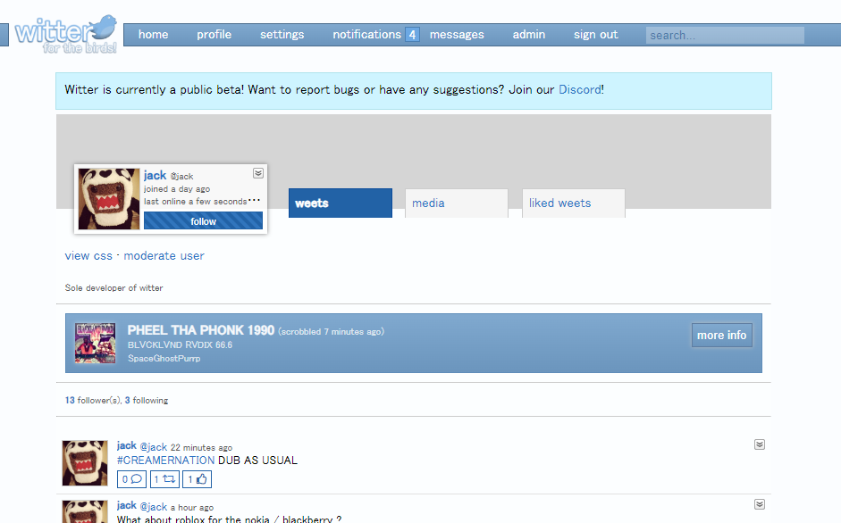

# Witter
Witter is a social media site that attempted to recreate the feel and look of MySpace and Twitter together.

## Features
- **LastFM integration:** Integration with LastFM allowed for people to share what they were listening to.
- **Profile customization:** This feature borrowed heavily from MySpace's freedom when it came to customizing your avatar.
- **Fast and easy chatting:** The main page allowed you to see whoever was chatting - and when.

## Planned features
- **Profile Tags:** This feature would've allowed you to add tags to your profile - so you can allow people to know what your profile is about.
- **Online Games:** Play videogames together like Tetris or Pong with the power of WebSockets - unfortunately this was never completed.
- **Auto-updating feed** This feature would've been way easier to implement with the use of Laravel.

## The Future
- Unfortunately, this project suffered the same fate as [uTue](https://github.com/d9mz/youtube) - built on a clunky framework, this project was not meant to last for too long.
- I may use Laravel to rewrite this entire project - as it is very simple, but full of depth. I'm not sure when, though.
